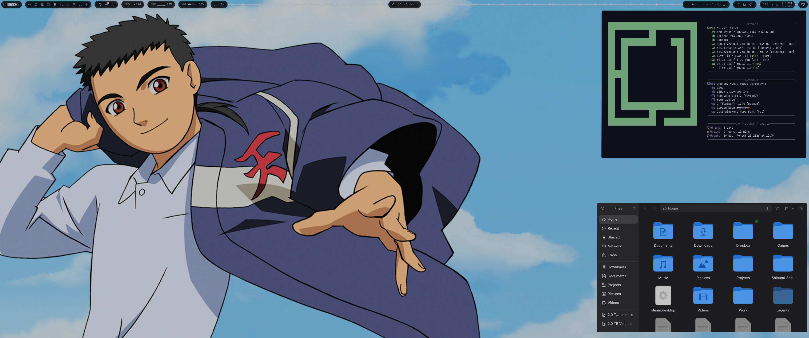

# Omarchy Tenchi Muyo Theme

Tenchi Muyo is a dark palette sampled directly from the *Tenchi Ultrawide* wallpaper: a deep indigo-navy background pulled from the jacket, a bright sky-blue accent from the clouds, and a warm crimson red from the emblem. Gaps, corner rounding, and animations are all matched to the X-1632 theme (`gaps_in = 6`, `gaps_out = 8`, `rounding = 22`, `rounding_power = 1`).

## Preview



## Install

```bash
omarchy theme install https://github.com/Korgen-Jurai/omarchy-tenchi-muyo-theme.git
```

## What's included

- Terminal palette (`colors.toml`) — drives Alacritty, Kitty, Foot, Ghostty, btop, VS Code, Obsidian, and more via Omarchy's built-in templates
- Hyprland gaps/borders/rounding/animations (`hyprland.conf`, `hyprland.lua`)
- Icon theme pointer (`icons.theme` → Yaru-blue-dark)
- Wallpaper (`backgrounds/1-tenchi-muyo.jpg`)

## Wallpaper


